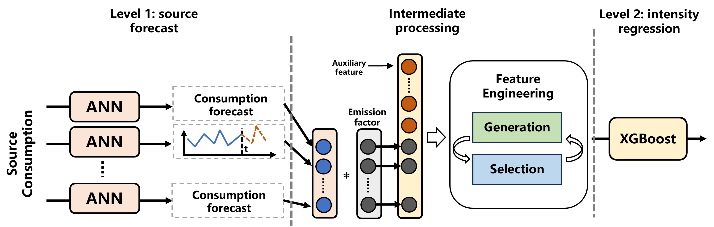

# Carbon-Aware Data Center Modelling, Assessment, and Optmization

## Project Information

### Project Description
This project is a joint collaboration between Alibaba Cloud and the University of Hong Kong. The project aims to develop advanced modelling and assessment methods for Alibaba cloud data centers to help optimize the operation and reduce carbon emissions. The collaboration is carried out through the scheme Alibaba Innovative Research (AIR). In this website, some important findings in the form of figures and analysis are presented in the [research output](#research-outcomes) section.

### AIR Project
[AIR](https://university.aliyun.com/activity/air) program is a collaborative platform between Alibaba Cloud and academic institutions to conduct scientific research. Its aim is to explore cutting-edge research in computer science, intelligent science, and related fields, and accelerate the application of research results. 

### Energy Digitalization Lab
[Energy Digitalization Laboratory](http://www.eeyiwang.com/index.html) at The University of Hong Kong (EDL@HKU) focuses on the digitalization of power and energy systems with an emphasis on the distribution and consumer side, including data analytics, data privacy, cyber-physical-social systems, Internet-of-things, etc. The overall goal is to make the distribution systems more adaptive to accommodate the high penetration of renewable energy towards a decarbonized future.

## Research Outcomes
The project is divided into four sub-tasks, each concerning one specific aspect. Some key findings or methodologies are summarized as below.

### Carbon Intensity Forecasting
Carbon intensity, or grid carbon intensity, measures the carbon emission per energy consumed with unit gCO2/kWh. This statistics is closely related renewable generation and can be used as guideline for low carbon electricity consumption. It is critical to develop accurate short term forecasting methods so that data center operators can optimally place their computing tasks in times and regions with lower carbon intensity.

   

To achieve lower forecasting error, Figure in this project we propose a leveled forecasting framework with feature enigeering method for performance enhancement.

### Data Center Electricity Consumption Flexibility Assessment

